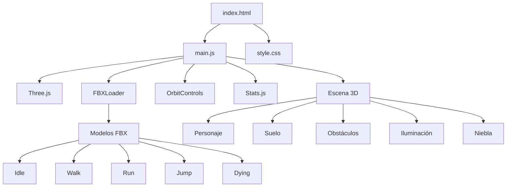
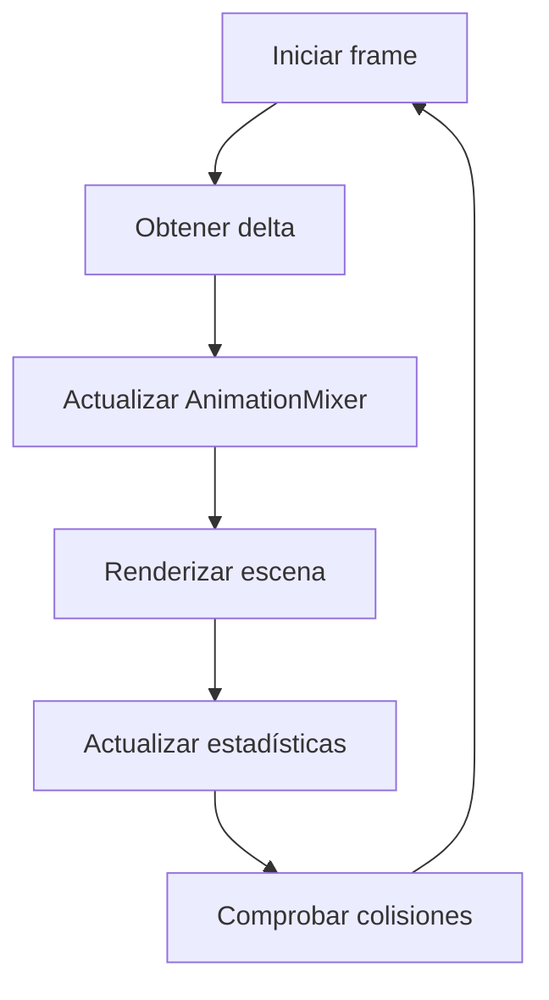

<div align="center">

# 🎮 Control de Personaje 3D con Three.js

### Escena web interactiva para cargar, animar y controlar un personaje modelado en 3D.

[](https://threejs.org/)
[](https://developer.mozilla.org/es/docs/Web/JavaScript)
[](https://developer.mozilla.org/es/docs/Web/API/WebGL_API)
[](#)

</div>

---

## 📖 Descripción

**Control de Personaje 3D con Three.js** es un prototipo web interactivo que permite cargar, visualizar y controlar un personaje animado dentro de una escena tridimensional.

El proyecto utiliza **Three.js** y WebGL para renderizar el escenario, mientras que `FBXLoader` se encarga de cargar los modelos y animaciones en formato FBX.

La aplicación incluye controles de movimiento, cambio de animaciones, movimiento de cámara, iluminación, niebla, sombras, obstáculos y detección básica de colisiones.

---

## ✨ Funcionalidades

- Renderizado de una escena tridimensional en el navegador.
- Carga de modelos y animaciones en formato FBX.
- Control del personaje mediante teclado.
- Cambio entre diferentes animaciones.
- Movimiento independiente de la cámara.
- Control orbital con el mouse.
- Animación de salto.
- Iluminación hemisférica y direccional.
- Control manual de la intensidad de la iluminación.
- Control de la distancia de la niebla.
- Generación de obstáculos dentro del escenario.
- Detección básica de colisiones mediante cajas envolventes.
- Sombras dinámicas.
- Adaptación automática al tamaño de la ventana.
- Visualización de estadísticas de rendimiento.

---
<!--
## 🖥️ Demostración

Agrega una captura del proyecto dentro de:

```text
docs/screenshots/
```

Después utiliza:


También puedes incluir un GIF que muestre el movimiento del personaje:


---
-->
## 🎮 Controles

### Movimiento del personaje

| Tecla | Acción |
|---|---|
| `W` | Avanzar |
| `S` | Retroceder |
| `A` | Girar y desplazarse a la izquierda |
| `D` | Girar y desplazarse a la derecha |
| `Espacio` | Saltar |

### Selección de animaciones

| Tecla | Animación |
|---:|---|
| `1` | Idle |
| `2` | Walk |
| `3` | Run |
| `4` | Jump |
| `5` | Dying |

### Movimiento de cámara

| Tecla | Acción |
|---|---|
| `↑` | Mover la cámara hacia adelante |
| `↓` | Mover la cámara hacia atrás |
| `←` | Desplazar la cámara a la izquierda |
| `→` | Desplazar la cámara a la derecha |
| Mouse | Rotar la vista mediante OrbitControls |

---

## 🛠️ Tecnologías utilizadas

### Desarrollo

- HTML5
- CSS3
- JavaScript ES6
- Módulos de JavaScript

### Gráficos 3D

- Three.js
- WebGL
- FBXLoader
- AnimationMixer
- OrbitControls
- Stats.js

### Conceptos implementados

- Escenas 3D
- Cámaras en perspectiva
- Renderizado en tiempo real
- Iluminación
- Sombras
- Niebla
- Modelos FBX
- Animaciones esqueléticas
- Transformaciones tridimensionales
- Detección de colisiones AABB
- Gestión de recursos gráficos

---

## 🏗️ Arquitectura general



---

## 📂 Estructura del proyecto

```text
control-3D-modeled-character/
│
├── build/
│   └── three.module.js
│
├── jsm/
│   ├── controls/
│   │   └── OrbitControls.js
│   ├── libs/
│   │   └── stats.module.js
│   └── loaders/
│       └── FBXLoader.js
│
├── models/
│   └── fbx/
│       ├── Idle.fbx
│       ├── Walk.fbx
│       ├── Run.fbx
│       ├── Jump.fbx
│       └── Dying.fbx
│
├── docs/
│   └── screenshots/
│       ├── escena-3d.png
│       └── demostracion.gif
│
├── index.html
├── main.js
├── style.css
└── README.md
```

---

## 🧍 Carga del personaje

Los modelos se cargan mediante `FBXLoader`.

```javascript
loader = new FBXLoader();

loader.load(
  `models/fbx/${asset}.fbx`,
  (group) => {
    object = group;
    scene.add(object);
  }
);
```

El nombre de la animación seleccionada determina el archivo que se carga:

```javascript
const assets = [
  "Idle",
  "Walk",
  "Run",
  "Jump",
  "Dying"
];
```

Cada archivo FBX contiene el modelo o la animación correspondiente.

---

## 🎞️ Sistema de animaciones

Cuando un modelo contiene animaciones, se crea un `AnimationMixer`:

```javascript
mixer = new THREE.AnimationMixer(object);

const action = mixer.clipAction(
  object.animations[0]
);

action.play();
```

El mezclador se actualiza durante cada ciclo de renderizado:

```javascript
function animate() {
  const delta = clock.getDelta();

  if (mixer) {
    mixer.update(delta);
  }

  renderer.render(scene, camera);
  stats.update();
}
```

Cuando una animación termina, el personaje vuelve al estado `Idle`.

---

## 🕹️ Movimiento del personaje

El personaje se mueve utilizando transformaciones locales.

### Avanzar

```javascript
function moveForward() {
  object.translateZ(-step);
}
```

### Retroceder

```javascript
function moveBackward() {
  object.translateZ(step);
}
```

### Girar a la izquierda

```javascript
function moveLeft() {
  object.rotateY(Math.PI / 2);
  object.translateZ(-step);
}
```

### Girar a la derecha

```javascript
function moveRight() {
  object.rotateY(-Math.PI / 2);
  object.translateZ(-step);
}
```

La distancia recorrida por cada pulsación se controla mediante:

```javascript
const step = 50;
```

---

## 🦘 Sistema de salto

El salto modifica temporalmente la posición vertical del personaje mediante una función sinusoidal:

```javascript
const y =
  jumpHeight *
  Math.sin(progress * Math.PI);

object.position.y = y;
```

Este cálculo genera un movimiento ascendente y descendente progresivo.

Parámetros principales:

```javascript
const jumpHeight = 100;
const jumpDuration = 0.6;
```

---

## 🎥 Cámara

La escena utiliza una cámara en perspectiva:

```javascript
camera = new THREE.PerspectiveCamera(
  45,
  window.innerWidth / window.innerHeight,
  1,
  2000
);
```

Posición inicial:

```javascript
camera.position.set(100, 200, 300);
```

Además de `OrbitControls`, la cámara puede desplazarse mediante las flechas del teclado.

```javascript
const cameraStep = 20;
```

---

## 💡 Iluminación

La escena utiliza dos tipos de iluminación.

### Luz hemisférica

```javascript
const hemiLight =
  new THREE.HemisphereLight(
    "red",
    "white",
    5
  );
```

### Luz direccional

```javascript
const dirLight =
  new THREE.DirectionalLight(
    "white",
    5
  );
```

La luz direccional proyecta sombras sobre el escenario.

La intensidad puede modificarse mediante un control deslizante ubicado en la interfaz.

---

## 🌫️ Niebla

La escena utiliza `THREE.Fog` para limitar la visibilidad de los objetos más alejados:

```javascript
scene.fog = new THREE.Fog(
  0xa0a0a0,
  initialFogDistance * 0.5,
  initialFogDistance
);
```

El usuario puede cambiar la distancia de la niebla desde un control deslizante.

---

## 🧊 Obstáculos

El escenario genera múltiples cubos distribuidos aleatoriamente.

```javascript
const geometry =
  new THREE.BoxGeometry(40, 40, 40);

for (let i = 0; i < 150; i++) {
  const cube = new THREE.Mesh(
    geometry,
    material
  );

  cube.position.x =
    Math.random() * 1600 - 800;

  cube.position.z =
    Math.random() * 1600 - 800;

  scene.add(cube);
}
```

Estos elementos funcionan como obstáculos y ayudan a experimentar con la navegación y las colisiones dentro de la escena.

---

## 💥 Detección de colisiones

La detección se realiza mediante cajas envolventes tridimensionales (`THREE.Box3`).

```javascript
const characterBox =
  new THREE.Box3().setFromObject(object);

const cubeBox =
  new THREE.Box3().setFromObject(cube);

if (characterBox.intersectsBox(cubeBox)) {
  console.log("Colisión detectada");
}
```

Actualmente, la colisión se registra en la consola. No bloquea el movimiento ni reposiciona al personaje.

En una versión futura se podría:

- Impedir el desplazamiento.
- Restaurar la posición anterior.
- Reproducir una animación.
- Cambiar el color del obstáculo.
- Disminuir la salud del personaje.
- Registrar un evento dentro del juego.

---

## 🔄 Ciclo de renderizado

El renderizado se ejecuta de manera continua mediante:

```javascript
renderer.setAnimationLoop(animate);
```

En cada ciclo se realizan las siguientes acciones:

1. Calcular el tiempo transcurrido.
2. Actualizar el mezclador de animaciones.
3. Renderizar la escena.
4. Actualizar las estadísticas.
5. Comprobar las colisiones.



---

## 🚀 Instalación y ejecución

El proyecto utiliza módulos JavaScript y carga modelos FBX, por lo que debe ejecutarse mediante un servidor local.

### 1. Clonar el repositorio

```bash
git clone https://github.com/UrielAhumada/control-3D-modeled-character.git
```

### 2. Entrar en la carpeta

```bash
cd control-3D-modeled-character
```

### 3. Iniciar un servidor local

Con Python:

```bash
python -m http.server 5500
```

También puedes utilizar la extensión **Live Server** de Visual Studio Code.

### 4. Abrir el proyecto

```text
http://localhost:5500
```

No se recomienda abrir directamente `index.html` mediante `file://`, porque el navegador puede bloquear la carga de los módulos y modelos.

---

## ⚠️ Estado actual

Este repositorio representa un prototipo académico y experimental.

La implementación actual permite estudiar:

- Carga de modelos FBX.
- Animaciones 3D.
- Movimiento de personajes.
- Cámaras.
- Iluminación.
- Niebla.
- Colisiones básicas.
- Renderizado en tiempo real.

Algunas funcionalidades todavía requieren ajustes para utilizarse como base de un videojuego completo.

---

## 🚧 Posibles mejoras

- Mantener un solo modelo y cambiar únicamente los clips de animación.
- Evitar recargar el archivo FBX con cada cambio de estado.
- Implementar una máquina de estados para las animaciones.
- Separar la lógica en diferentes módulos.
- Utilizar `event.code` en lugar de `event.keyCode`.
- Implementar movimiento continuo mientras una tecla permanece presionada.
- Vincular automáticamente las animaciones al movimiento.
- Evitar cambios bruscos de rotación.
- Implementar interpolación entre animaciones.
- Bloquear el movimiento al detectar una colisión.
- Optimizar la detección de colisiones.
- Utilizar `InstancedMesh` para los obstáculos.
- Agregar texturas y materiales al escenario.
- Incorporar sonidos y efectos visuales.
- Agregar una interfaz de pausa.
- Añadir controles para dispositivos móviles.
- Crear una barra de salud.
- Incorporar objetivos o elementos coleccionables.
- Añadir pruebas de rendimiento.
- Migrar el proyecto a Vite.
- Gestionar Three.js mediante npm.
- Publicar una demostración mediante GitHub Pages.
- Documentar la licencia y procedencia de los modelos FBX.

---

## 🎯 Aprendizajes

Durante el desarrollo de este proyecto se reforzaron conocimientos relacionados con:

- Fundamentos de gráficos tridimensionales.
- Uso de Three.js.
- Renderizado mediante WebGL.
- Carga de modelos FBX.
- Animaciones con `AnimationMixer`.
- Transformaciones de posición y rotación.
- Control de cámaras.
- Iluminación y sombras.
- Efectos de niebla.
- Manejo de eventos del teclado.
- Detección de colisiones.
- Cajas envolventes tridimensionales.
- Administración básica de recursos gráficos.
- Diseño de ciclos de renderizado.
- Desarrollo de experiencias interactivas para navegador.

---

## 👨‍💻 Autor

**Uriel Ahumada Huerta**

- GitHub: [@UrielAhumada](https://github.com/UrielAhumada)
- LinkedIn: [Uriel Ahumada Huerta](https://www.linkedin.com/in/uriel-ahumada-huerta-362b96380/)
- Correo: [urielahumadahuerta@gmail.com](mailto:urielahumadahuerta@gmail.com)

---

<div align="center">

Proyecto desarrollado para experimentar con gráficos 3D, animaciones, interacción y control de personajes mediante Three.js.

</div>
